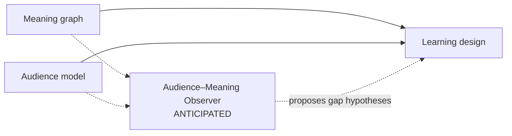

# Capability Horizon: Audience–Meaning Observer

**Status:** `ANTICIPATED` — not operating, not contracted, and not on the current build path.

## Architectural position



**Diagram convention:**

- Solid node = operating.
- Outline node = contracted but not yet exercised.
- Dashed node = anticipated capability; not load-bearing.

## Purpose

Continuously compare newly governed organizational meaning with persistent audience models to identify possible learning needs.

The Observer asks:

> Given what the organization now says is true or required, which audiences may lack the knowledge, judgment, or capability to act accordingly?

## Would read

- Validated meaning atoms and their source provenance.
- Audience roles, tasks, competencies, and known misconceptions.
- Relevant performance or incident evidence.
- Changes to procedures, policies, responsibilities, or other governed meaning.

## Might eventually write

- Learning-need candidates or gap hypotheses.

Each candidate could identify:

- The affected audience.
- The required behavior or capability.
- The suspected current-state gap.
- Supporting meaning and source atoms.
- Why the gap matters.
- Confidence and evidence still needed.
- Whether learning could plausibly address it.
- Alternative non-learning causes.

## Would not

- Modify canonical meaning.
- Declare that training is required.
- Create learning objectives.
- Commission courses.
- Write audience profiles.
- Convert provisional ingestion signals directly into learning requirements.

## Downstream authority

The **Strategist** determines whether a candidate gap warrants intervention and whether the problem is plausibly addressable through learning.

The **Designer** translates a ratified learning need into objectives, an evidence plan, and an instructional design.

```text
Audience–Meaning Observer
        ↓ proposes a possible gap
Strategist
        ↓ determines whether intervention is warranted
Designer
        ↓ defines what must be learned and demonstrated
Course pipeline
        ↓ produces the intervention
```

## Possible operating depths

### Watch mode

During ingestion, surface weak signals without asserting that a learning need exists.

### Assessment mode

After meaning has been validated, produce evidence-backed gap hypotheses pinned to the relevant atom hashes.

## Why deferred

The persistent audience model, goal/warrant contract, and course vertical must exist before this capability has meaningful inputs or consumers.

The current architecture should preserve the possibility of the future join through stable atom identities and a separately governed audience model. It should not add speculative fields or dependencies solely for this anticipated capability.

## Activation signals

- Repeated manual discovery of learning needs from newly ingested material.
- A populated and governed audience model.
- A working goal, gap, and intervention-warrant workflow.
- Evidence that proactive detection would produce actionable value.
- A downstream process capable of reviewing and disposing of gap hypotheses.

## Current implementation boundary

Do **not** yet create:

- An agent directory.
- A system prompt.
- A schema.
- A tool.
- A registry.
- A wake-condition implementation.

Those artifacts would make the capability appear operational and could cause later work to design around an untested hypothesis.

## Promotion path

```text
Horizon idea
→ evidence-backed candidate
→ accepted contract
→ implementation
→ operating capability
```

When activation signals are met, promote this entry into its own governed architecture document. Replace the horizon entry with a short pointer to that document and record the acceptance decision separately.

## Governing principle

> **Remember the future without prepaying for it.**

