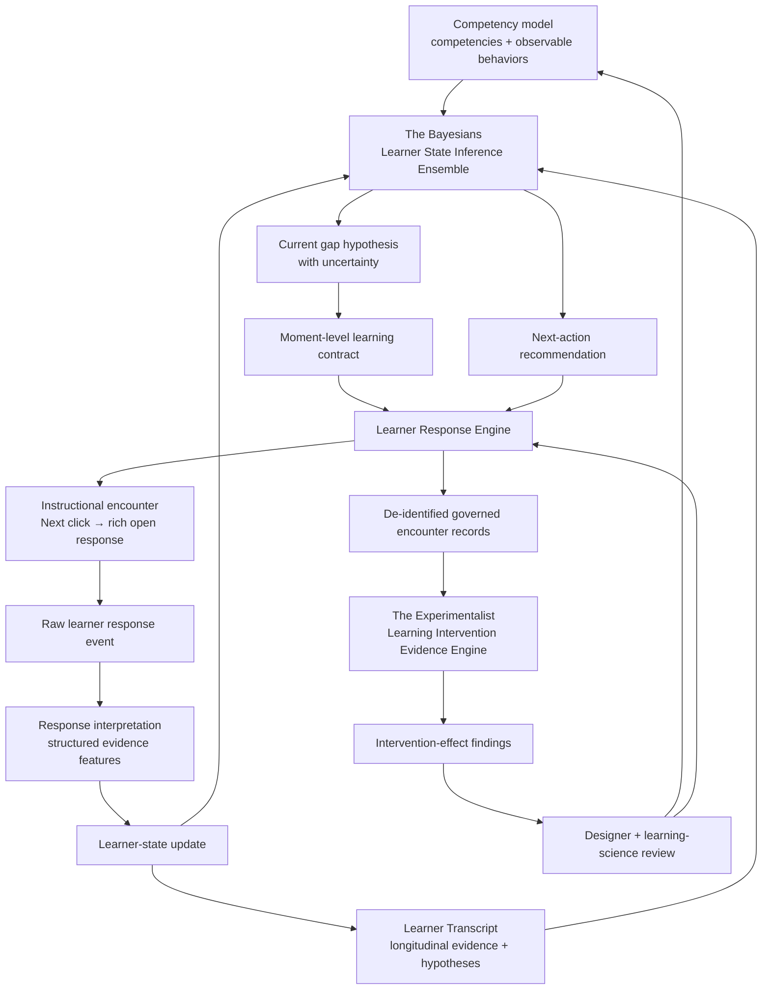

# Capability Horizon: Learner Response Intelligence

## The Bayesians, the Learner Transcript, and The Experimentalist

**Horizon family:** `learner_response_intelligence`  
**Status:** `ANTICIPATED` — not operating, not contracted, and not on the current production build path.  
**Depends on:** A functioning Learner Response Engine, a governed competency model, observable-behavior definitions, a response-event contract, and separate learner-data governance.  
**Short description:** A future constellation of capabilities that maintains evidence-weighted hypotheses about learner capability, adapts instructional encounters, preserves a governed longitudinal learner transcript, and uses accumulated prediction error to learn about learning itself.

## North star

> The purpose is not primarily to make a course feel personalized. It is to turn every instructional encounter into a testable claim about learning—and to let accumulated prediction error teach the system where its theories of learning are wrong.

The system should maintain hypotheses rather than verdicts. It observes learner behavior, compares observed evidence with predicted evidence, updates its uncertainty, and selects the next appropriate encounter. Across many governed encounters, it also studies whether interventions produce the changes they were designed to produce.

## Architectural constellation



## Foundational distinction: learning is inferred

The system cannot directly observe that a learner “gained 0.3 competence.” It observes behavior and treats that behavior as evidence about an underlying competency state.

```text
Expected evidence
        versus
Observed evidence
        ↓
Estimated learner-state delta
```

The phrase **real delta** therefore means the best current evidence-backed estimate of change, not direct access to an internal mental state.

| Response | What it may support | What it cannot justify by itself |
|---|---|---|
| Click Next | Exposure and willingness to proceed | Understanding or mastery |
| Correct recall response | Possible retrieval | Transfer or durable retention |
| Correct scenario decision | Possible application in that context | Generalized capability |
| Open-ended explanation | Reasoning structure and misconception evidence | Guaranteed workplace performance |
| Delayed successful application | Retention and transfer | Every future context |
| Workplace observation | Applied behavior | Whether training caused the behavior |

Every evidence record should state what an observation can and cannot support.

---

# Capability 1: The Bayesians

## Learner State Inference Ensemble

**Tag:** `learner_state_inference_ensemble`  
**Status:** `ANTICIPATED`  
**Short description:** Maintains explicit, evidence-weighted hypotheses about learner capability; creates moment-level learning contracts; predicts observable change; updates learner-state estimates from governed response evidence; and informs the Learner Response Engine’s next-action choices without converting uncertainty into verdicts.

The plural name is intentional. The system should maintain competing hypotheses rather than reducing the learner to one definitive label.

## Governing question

> Given the evidence available now, what should we believe about this learner’s current capability, what remains uncertain, and which encounter would most responsibly advance learning or reduce uncertainty?

## Would read

- The governed competency and objective ontology.
- Observable-behavior definitions.
- Misconception hypotheses.
- The learner’s prior response history.
- Current learner-state hypotheses.
- Prior interventions and their versions.
- Scene-level learning contracts.
- Structured response interpretations.
- Confidence and uncertainty.
- Time elapsed since prior evidence.
- Context and audience information permitted under learner-data governance.

## Might eventually write

- Learner-state hypotheses.
- Competency-level probability distributions or confidence bands.
- Active misconception hypotheses.
- Uncertainty and evidentiary-insufficiency flags.
- Predicted response patterns.
- Moment-level learning contracts.
- Updated state estimates.
- Recommended evidence needs.
- Candidate next-action constraints or recommendations.

## Would not

- Declare competence from one thin observation.
- Treat clicks as evidence of mastery.
- Collapse uncertainty into a binary label.
- Diagnose personality or psychological traits without legitimate evidence and authority.
- Infer sensitive traits from behavioral proxies.
- Rewrite the competency model.
- Change global instructional policy based on one learner.
- Allow an interpreting model to update state without cited response evidence.
- Optimize engagement at the expense of learning or learner welfare.
- Make high-stakes employment decisions.

## Governing principle

> **Maintain hypotheses, not verdicts.**

## The competency model

The competency model must decompose capabilities into observable behaviors.

Example:

```text
Competency:
Apply adverse-event reporting requirements

Observable behaviors:
- identifies potentially reportable information
- acts despite incomplete information
- selects the correct reporting channel
- acts within the required timeframe
- distinguishes reporting from causality determination
```

Each behavior requires an evidence model:

- What observations support the capability?
- What observations indicate a specific misconception?
- How diagnostic is each observation?
- What alternative explanations exist?
- What evidence would disconfirm the current belief?
- How much and what variety of evidence is required before confidence changes materially?

## Moment-level learning contract

Before presenting an instructional encounter, the system records the hypothesis being tested.

| Field | Example |
|---|---|
| Target competency | Act despite incomplete safety information |
| Current hypothesis | Learner may believe causality must be established first |
| Prior confidence | Moderate |
| Intervention | Ambiguous reporting scenario |
| Expected delta | Reduce reliance on the causality misconception |
| Supporting evidence | Reports promptly and explains that certainty is unnecessary |
| Partial evidence | Reports promptly but provides an unrelated rationale |
| Disconfirming evidence | Delays reporting until causality is confirmed |
| Low-information response | Selects correctly after obvious cueing |
| Next action if supported | Advance to harder transfer scenario |
| Next action if uncertain | Ask for rationale |
| Next action if contradicted | Provide contrastive feedback and retest |

The encounter therefore becomes a falsifiable claim about learning rather than merely a screen in a sequence.

## Open-ended model-mediated responses

A rich learner response may be interpreted into governed evidence features:

```text
recognized_reportability: true
recognized_uncertainty_rule: true
selected_correct_timeline: true
causality_gate_misconception: false
confidence: 0.81
supporting_excerpt: ...
```

The interpreting model is not itself authoritative. Its judgment requires:

- A governed rubric.
- Versioned prompts and models.
- Cited excerpts from the learner response.
- Confidence.
- Evaluation against human scoring.
- An abstention threshold.
- Escalation when uncertain.
- A record of the model and rubric versions used.

The state updater consumes structured evidence, not an unexamined model verdict.

---

# Capability 2: The Learner Transcript

## Governed Longitudinal Learner Evidence Record

**Tag:** `learner_transcript`  
**Status:** `ANTICIPATED`  
**Kind:** Governed learner-data store and projection, not necessarily an agent.  
**Short description:** A continuously refining, inspectable record of learner encounters, observed evidence, current hypotheses, uncertainty, declared goals, and longitudinal change.

The Learner Transcript resembles a living learner profile, but it must distinguish raw events from interpretations and current hypotheses. It should never become a mutable psychological narrative whose origins cannot be inspected.

## Internal layers

```text
1. Raw event log
   What the learner actually encountered and did

2. Evidence ledger
   Structured features interpreted from those events

3. State-hypothesis history
   What The Bayesians believed before and after each encounter

4. Learner-facing transcript projection
   A comprehensible view of progress, uncertainty, goals, and evidence
```

These layers must remain separable. A new interpretation should not rewrite the historical event that produced it.

## Might contain

- Learner-controlled identity reference.
- Competencies and goals currently in scope.
- Encounter IDs and exact intervention versions.
- Raw response-event references.
- Structured evidence features.
- Prior and posterior learner-state hypotheses.
- Active misconception hypotheses.
- Confidence and uncertainty.
- Feedback supplied.
- Subsequent retention and transfer evidence.
- Learner corrections or challenges to the record.
- Human coach or reviewer annotations where authorized.
- Provenance for every model-mediated interpretation.

## Must distinguish

- **Observed:** the learner selected option B.
- **Interpreted:** the response may indicate a causality-gate misconception.
- **Inferred:** current evidence suggests low confidence in applying the rule under uncertainty.
- **Declared:** the learner says they are uncertain about the reporting channel.
- **Validated:** a qualified human or later performance evidence confirms the interpretation.

## Learner agency

The learner should ultimately be able to:

- See what data exists about them.
- Understand why the system currently holds a hypothesis.
- Correct factual errors.
- Challenge an interpretation.
- Know what evidence would change the estimate.
- Control or understand permitted uses.
- Request deletion or correction where applicable.
- Distinguish learning support from employment evaluation.

## PII and sensitive-data bridge

The Learner Transcript belongs in a separately governed learner-data domain. It must never be embedded in the content graph.

Future governance must address:

- Lawful basis and informed notice.
- Purpose limitation.
- Data minimization.
- Role-based access.
- Encryption and separation from course content.
- Retention and deletion periods.
- Learner correction and access rights.
- Restrictions on employment and performance-management use.
- Sensitive-trait and proxy inference.
- Cross-border data handling.
- Model-provider data exposure.
- Auditability of automated interpretation.
- Human review for consequential decisions.
- De-identification before population-level research.

## Governing principle

> **The transcript records evidence and evolving hypotheses; it does not define the person.**

---

# Capability 3: The Experimentalist

## Learning Intervention Evidence Engine

**Tag:** `learning_intervention_evidence_engine`  
**Status:** `ANTICIPATED`  
**Short description:** Examines governed intervention–prediction–response records across learners and contexts; identifies where instructional predictions repeatedly succeed or fail; and proposes evidence-backed revisions to learning hypotheses without silently rewriting global instructional policy.

## Governing question

> What should we believe about the effectiveness of this intervention across learners, audiences, contexts, time, and transfer conditions?

The Bayesians learn about the current learner. The Experimentalist learns about learning interventions.

## Would read

- De-identified encounter records.
- Versioned interventions and learning contracts.
- Predicted learner deltas.
- Observed evidence patterns.
- Retention and transfer evidence.
- Audience and context variables permitted for analysis.
- Competency and misconception models.
- Intervention-selection history.
- Human review findings.
- Known confounds and missing evidence.

## Might eventually write

- Intervention-effect findings.
- Prediction-error patterns.
- Audience- or context-specific effectiveness hypotheses.
- Retention and transfer findings.
- Candidate revisions to instructional strategies.
- Requests for better evidence or new experiments.
- Warnings about misleading metrics.
- Proposals for comparison conditions or controlled pilots.

## Would not

- Confuse correlation with causation.
- Treat engagement as learning.
- Treat easy-item success as intervention effectiveness.
- Rewrite the competency model or production courses automatically.
- Generalize across audiences without evidence.
- Use identifiable learner data when de-identified evidence is sufficient.
- Conceal uncertainty or contradictory findings.
- Optimize only for immediate performance while ignoring retention, transfer, or harm.

## Questions it could eventually investigate

- Does this contrastive example correct the targeted misconception?
- For which audience segments?
- How much practice produces transfer?
- Does open explanation predict delayed application?
- Does a click-to-reveal contribute anything beyond exposure?
- Which feedback works when confidence is high but reasoning is wrong?
- Which intervention appears effective immediately but fails on retention?
- When does personalization improve learning, and when does it merely add complexity?

## Governing principle

> **Prediction error is learning evidence for the system.**

---

# The two learning loops

## Loop 1: Learn about this learner

```text
Prior learner-state hypothesis
→ encounter
→ response evidence
→ updated learner-state hypothesis
→ next encounter
```

This supports responsible runtime adaptation.

## Loop 2: Learn about learning

```text
Predicted intervention effect
→ observed evidence patterns
→ prediction error
→ revised intervention hypothesis
→ human and learning-science review
→ improved future design
```

This supports institutional learning about how learning works.

The individual loop may update during a session. The population-level loop must move more carefully because it risks confusing selection effects, model-scoring artifacts, audience differences, and other confounds with instructional effects.

---

# Learner Response Engine dependency

Without a functioning Learner Response Engine, this constellation remains a static model.

The LRE must eventually provide:

- Versioned instructional encounters.
- Known interventions and their IDs.
- Structured response events.
- Interaction state.
- Timing and sequence.
- Assessment and rubric evidence.
- Open-response capture.
- Next-action execution.
- Longitudinal continuity.
- Explicit learning contracts.
- Traceability from response to competency and intervention.

The response continuum may range from:

```text
Click Next
→ select an option
→ manipulate or sequence objects
→ explain a choice
→ solve an open scenario
→ demonstrate performance
→ provide delayed transfer evidence
```

Different responses carry different evidentiary weight. The runtime must not treat every interaction as equally informative.

---

# Activation signals

Do not implement this constellation until:

- The competency and objective ontology is stable enough to reference.
- Competencies have observable-behavior definitions.
- Misconceptions can be represented as hypotheses.
- The Learner Response Engine emits a governed event schema.
- Scenes can carry explicit learning contracts.
- Response interpretations have evaluation and provenance.
- A deterministic branching version of the LRE works first.
- Learner data has approved privacy, access, retention, and correction governance.
- Intervention versions and response evidence can be joined reliably.
- A longitudinal pilot can collect evidence safely.
- Qualified humans are available to review instructional and statistical conclusions.

## Recommended first rung

Begin with transparent rules rather than probabilistic inference:

```text
If the response demonstrates A and B but not C:
  record these evidence flags;
  preserve the supporting response excerpt;
  route to this next encounter;
  state what remains unknown.
```

Only after the evidence contracts and routing behavior work should probabilistic state inference replace or augment those rules.

---

# Current implementation boundary

Do **not** yet create:

- A production learner model.
- A persistent PII store.
- Psychological or personality inference.
- Automated high-stakes learner decisions.
- A Bayesian inference service.
- A population-level experimentation platform.
- Autonomous global course optimization.
- Provider-dependent open-response scoring without an evaluation harness.
- Personalization claims unsupported by learning evidence.

The present architecture should preserve the future joins through stable competency, objective, intervention, scene, and response-event identities. It should not prebuild speculative inference machinery.

---

# Promotion path

```text
Horizon constellation
→ governed competency and evidence contracts
→ deterministic LRE pilot
→ inspectable learner transcript prototype
→ evaluated response interpretation
→ rule-based state updates
→ limited Bayesian pilot
→ human-reviewed intervention evidence
→ operating learner-response intelligence
```

---

# Governing principles

> **Maintain hypotheses, not verdicts.**

> **The transcript records evidence and evolving hypotheses; it does not define the person.**

> **Prediction error is learning evidence for the system.**

> **Adaptation must remain inspectable, contestable, and subordinate to learner welfare.**

> **Remember the future without prepaying for it.**

