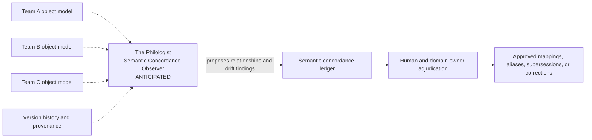

# Capability Horizon: The Philologist

## Semantic Concordance Observer

**Tag:** `semantic_concordance_observer`  
**Status:** `ANTICIPATED` — not operating, not contracted, and not on the current build path.  
**Short description:** Observes meaning across governed object models, teams, sources, and time; proposes semantic relationships and drift findings without silently normalizing legitimate variation or deciding authority.

## Institutional-cognition purpose

The Philologist supports Trainstorm's larger goal of **institutional cognition**: infrastructure that helps an organization preserve, compare, reconcile, and reason across what it collectively knows.

Its governing question is:

> Are these concepts the same, related, contextually different, historically changed, or genuinely conflicting—and does anyone relying on them need to know?

The objective is not to force every team into one universal taxonomy. It is to enable **semantic federation**: different groups may retain legitimate domain models while their overlaps, differences, and dependencies remain visible and governable.

## Architectural position



**Diagram convention:**

- Solid node = operating.
- Outline node = contracted but not yet exercised.
- Dashed node = anticipated capability; not load-bearing.

The Philologist sits perpendicular to individual object models. It is a Manifold-governance faculty rather than a stage in the course-production pipeline.

## The drift it observes

| Drift type | Example | Typical interpretation |
|---|---|---|
| Lexical variation | “Learner” versus “training participant” | Often harmless |
| Synonym duplication | Two IDs represent the same concept | Usually requires a mapping |
| Homonym collision | Two teams use “case” to mean different things | Dangerous if unnoticed |
| Scope difference | “Medical reviewer” is broader in one model | May be legitimate |
| Structural difference | One team classifies by role; another by workflow | Often complementary |
| Semantic change | A term retains its ID but its definition shifts | High-risk |
| Authority conflict | Two governed sources make incompatible claims | Requires human adjudication |
| Temporal supersession | A new policy intentionally replaces old meaning | Legitimate, but must propagate |
| Schema drift | A field or allowed value changes | Primarily deterministic tooling |

Taxonomy variation is not presumed to be a defect. Different teams may model the same organizational reality differently because they interact with it through different workflows, authorities, and purposes.

## Would read

- Multiple governed object models.
- Taxonomies, ontologies, vocabularies, and registries.
- Canonical definitions.
- Source provenance and authority.
- Version histories and content hashes.
- Usage contexts.
- Existing semantic crosswalks.
- Changes introduced during new ingestion.
- Downstream references that could be affected by a change.

## Might eventually write

A **semantic concordance ledger** containing candidate relationships such as:

- `same_as`
- `broader_than`
- `narrower_than`
- `overlaps_with`
- `contextual_variant_of`
- `conflicts_with`
- `supersedes`
- `possibly_duplicate`
- `meaning_changed_since`

Each candidate finding could retain:

- The compared objects.
- The proposed semantic relationship.
- Supporting evidence.
- Relevant organizational or workflow contexts.
- Confidence.
- Potential downstream impact.
- Source authority.
- The human or domain owner required for resolution.

## Would not

- Silently merge stable IDs.
- Rewrite canonical source meaning.
- Declare one team's taxonomy universally correct.
- Flatten legitimate contextual variation.
- Resolve authority or policy disputes.
- Automatically propagate inferred mappings into production.
- Create a universal “master taxonomy” merely for tidiness.

Its operating discipline is:

> **Detect and propose; domain owners adjudicate.**

## Division of responsibility

```text
Deterministic tools
  → schema changes, missing references, ID collisions, and hash changes

The Philologist
  → meaning relationships, contextual variation, conceptual conflicts, and semantic drift

Human and domain governance
  → authority, policy, accepted mappings, supersession, and promotion
```

The Philologist performs the work that requires interpretation. Deterministic tools identify mechanically knowable changes. Humans decide which meanings and relationships become authoritative.

## Example

Medical Affairs, Pharmacovigilance, Quality, and L&D may each model a “medical reviewer” differently because each function encounters that role through a different workflow.

A concordance finding might propose:

```text
role_pv_medical_reviewer
  narrower_than: role_medical_reviewer
  contextualized_by: pharmacovigilance
  equivalent_for: selected training-assignment purposes
  not_equivalent_for: approval authority
```

This crosswalk allows systems to interoperate without pretending the concepts are identical.

## Why deferred

The Philologist should not be implemented until multiple substantial governed object models exist and real semantic drift has appeared. Building it earlier would mean designing a reconciliation system against hypothetical disagreement.

The current architecture should preserve the evidence the future capability will need:

- Stable IDs.
- Content hashes.
- Explicit provenance.
- Version histories.
- Governed vocabularies.
- Separate domain and client registries.
- References rather than copied values.

It should not add speculative semantic machinery solely for this anticipated capability.

## Activation signals

- Three or more substantial governed domain models exist.
- The same organizational concepts recur across those models.
- Manual semantic crosswalks are becoming common.
- A real semantic collision produces rework, ambiguity, or risk.
- Teams need to reuse meaning without surrendering their local taxonomies.
- Source changes repeatedly create ambiguous downstream consequences.
- Domain owners are available to review and adjudicate proposed relationships.

## Current implementation boundary

Do **not** yet create:

- An agent directory.
- A system prompt.
- A semantic-concordance schema.
- A cross-model matching service.
- A wake-condition implementation.
- An automatically promoted master ontology.

## Promotion path

```text
Horizon idea
→ real cross-model drift
→ evidence-backed candidate
→ accepted semantic-concordance contract
→ human-reviewed pilot
→ operating capability
```

When activation signals are met, promote this entry into a governed architecture document. Replace the horizon entry with a short pointer to that document and record the acceptance decision separately.

## Governing principles

> **Consolidate without averaging.**

> **Detect and propose; domain owners adjudicate.**

> **Remember the future without prepaying for it.**

