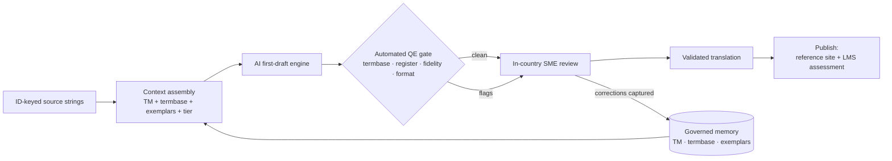

# AI-Assisted Localization Pipeline — Concept Brief

### A self-improving, human-in-the-loop system for validated translation of regulated content

**Context:** Developed against AST009 (global Product Safety Awareness training), proven first on the hardest case — Japanese, regulated, safety-critical. Designed to be a **reusable Astellas capability**, not a one-off.
**Purpose of this document:** to internalize the model and the vocabulary — what each part does, why it exists, and how the pieces form a *cognitive system* rather than a tool.
**Date:** 17 July 2026

---

## 1. The one-sentence thesis

Stop *buying* translations as a finished good, and instead *operate a system* that drafts translations with a grounded AI, catches its own mechanical errors automatically, routes only the judgment calls to a human expert, and **gets smarter every time that expert makes a correction.**

The difference that matters: a translation vendor is a black box you cannot improve — you found that out over two years of ad-hoc fixes. This system is the opposite: every correction is captured and fed back, so the same error never has to be caught twice.

---

## 2. The mental model — three actors and a loop

| Actor | Role | In our world |
|---|---|---|
| **The AI first-draft engine** | Produces the initial translation, *grounded* by retrieved context | An enterprise LLM (e.g., Azure OpenAI) |
| **The governed memory** | Holds what "Astellas-good" looks like: approved translations, locked terms, and worked examples | Translation memory + termbase + the exemplar corpus we just harvested |
| **The human validator** | Reviews, corrects, and confers "validated" status | Your in-country SME reviewer |
| **The loop** | Every human correction updates the memory, improving the next batch | Active learning |

That loop is what makes this a **cognitive system** and not a translation feature. The system uses in-context learning (it reasons from examples), assesses its own confidence (it flags its weak spots), and improves from feedback (it learns from corrections). Those three properties are the defensible core of the "Cognitive Systems Design" framing.

---

## 3. The pipeline, end to end

**Stage by stage:**

1. **ID-keyed source strings (the substrate).** Content lives as structured strings keyed to a stable ID — not trapped in a Storyline binary. This is the prerequisite that makes everything else deterministic; it's also the thing whose *absence* cost us the reconstruction tax in the harvest (the export's IDs didn't even join to the English master).

2. **Context assembly (the "examples of good" step — see §4).** For each source string, the system *retrieves and assembles* the context the model will see: relevant prior approved translations, the locked glossary terms that appear in this string, a couple of worked `bad → good` examples for this kind of content, and the content tier / register spec. This is **retrieval-augmented generation (RAG)** applied to translation.

3. **AI first-draft engine.** The grounded prompt goes to the model, which returns a draft *plus*, ideally, a short rationale and a self-flag on anything it's unsure about. Grounding is what separates this from "throwing text at ChatGPT."

4. **Automated quality-estimation (QE) gate.** Before any human sees it, deterministic checks run: termbase compliance (did it use `安全管理情報`, not the calque?), register checks (bare `患者`?), fidelity checks (back-translation sanity; number/date/placeholder integrity), and formatting. This is the gate that handled ~40% of the corrections in our harvest **with zero human effort**. Its job is to protect the reviewer's attention.

5. **Human-in-the-loop review (the validator).** The in-country SME sees a draft that has *already* passed the mechanical checks, with the model's uncertainty flags highlighting where to look. They approve or edit. **Their sign-off is what confers "validated" status** — identical to the regulatory model, so Quality isn't being asked to accept machine output as validated.

6. **Feedback capture → memory update (the loop).** Every edit is captured *with provenance* (who, when, why, which version, which ID) and folded back into the memory: approved output becomes new translation memory, corrections become new contrastive exemplars, and repeated term fixes get promoted to locked glossary entries. The next batch is measurably better.

7. **Publish.** Validated strings flow to their destination — the reference site (Tier 2/4 evergreen) or the LMS assessment (record-bearing, validated). Same pipeline, two destinations.

---

## 4. The heart of it: "examples of good," made rigorous

Your instinct — that you can lift AI translation quality *just* by supplying plenty of Astellas-correct examples — is exactly right, and here is the precise machinery behind it.

- **Few-shot in-context learning.** LLMs adapt their output to examples placed in the prompt. Show the model three Astellas-correct renderings and it mirrors that register, terminology, and style far better than a zero-shot request.
- **Retrieval, not a static list.** You don't paste the same generic examples every time. For each string, you *retrieve the most relevant* prior approved translations and worked examples — so a safety-definition string is drafted with safety-definition exemplars, a UI heading with heading exemplars.
- **Contrastive `bad → good` pairs.** The most powerful teaching signal isn't just "here's a good one" — it's "here's what a vendor got wrong and here's the fix," because it teaches the model the *specific failure mode* to avoid. Exemplar B from the harvest ("when the English says *how do we know*, render `知る`, not `確認する`") is exactly this.
- **Hard terminology constraints.** The locked glossary isn't a suggestion in the prompt — it's enforced and then *verified* by the QE gate. Hope is not a strategy for `安全管理情報`.

**The corpus we harvested is this instruction set.** The 1,164 pairs are the raw "examples of good"; the glossary candidates are the hard constraints; the taxonomy tells the retriever which examples to pull for which content. You are not theorizing about this technique — you have already built its fuel, from the hardest language, and you're right that essentially no one else at Astellas is doing it.

---

## 5. The two-speed design (why the 40/60 split matters)

The harvest revealed that the reviewer's work splits into two fundamentally different kinds, and the pipeline treats them differently — this is the core design insight:

- **~40% mechanical** (official term, brand casing, honorific, defined names). Handled by the **deterministic termbase + QE gate**. No model judgment, no human time. These should be *impossible* to get wrong, not "usually right."
- **~60% judgment** (fluency, fidelity to the English meaning). Handled by the **exemplar-grounded AI first draft + human review**. This is where the model and the examples earn their keep, and where the human's scarce attention is spent.

Designing for this split is what makes the system both *safe* (mechanical errors are structurally eliminated) and *efficient* (humans only touch what needs judgment).

---

## 6. Why this is especially strong for CJK / Japanese

The languages where AI "traditionally did poorly" are exactly where grounding helps most:

- **Register / keigo.** Japanese encodes politeness grammatically; `患者` vs `患者さん` is invisible to a naive model but obvious from exemplars. Examples teach register better than any rule.
- **Official terminology.** Japanese PV has *fixed* official vocabulary (`安全管理情報`; MedDRA-J; PMDA renderings). Grounding on those authoritative term maps is a lever a generic vendor linguist often applies inconsistently — and the QE gate enforces it every time.
- **Honest note on the frontier.** Older neural-MT (the DeepL/Google generation) genuinely struggled with CJK. Frontier LLMs from the last ~year have closed much of that gap *when grounded* — which strengthens the "why now" timing, the same logic that carries the modernization proposal. Don't overclaim that AI can't do Japanese; claim that *grounded* AI now can, and that CJK still warrants the most human review — which the pipeline provides.

---

## 7. Regulated-content guardrails (what makes it survive Quality/Legal)

- **The validation line stays bright.** AI produces the *first draft*; the human confers *validated* status. You are never asking Quality to treat machine output as validated. Safety-critical content (Tier 0/1, assessment items) always gets full human review.
- **Data security by design.** Content goes to an *enterprise* model deployment with no training on your data and appropriate residency. The happy accident: **Azure OpenAI sits inside the Azure footprint the modernization already assumes**, so DigitalX security hears "same platform, same controls."
- **Provenance and audit trail.** Every draft, check, edit, and sign-off is logged (model version, prompt, exemplars used, reviewer, timestamp, content version). That's the inspection story — and it's *stronger* than a vendor black box, where you can't reconstruct why a string reads the way it does.
- **Scope boundary.** The record-bearing system (LMS assessment) stays validated; the reference-site translation path is lighter. Draw that line explicitly with CSV/IT-Quality early — same move as the Part 11 scoping in the regulatory assessment.

---

## 8. How you prove it (the pilot that earns cross-Astellas reuse)

Don't argue it — measure it. Run a **head-to-head** on one bounded slice (e.g., one Japanese section): AI-first-draft-then-human-review versus the vendor path, instrumented on:

- **Post-edit effort** — how much the human had to change the AI draft (edit distance / time). The core efficiency metric.
- **Error-catch rate** — how many mechanical errors the QE gate caught before human review (you already have the ~40% baseline).
- **Turnaround** — source-change to validated-output, days vs. the vendor cycle.
- **Cost per thousand words** — AI + review vs. vendor fee.
- **Quality** — reviewer-judged fidelity/register, and residual errors found downstream.

If it proves out, you don't hold an opinion — you hold a **benchmark**, and a benchmark is portable to other content, other functions, and the Bold Initiatives conversation.

---

## 9. Honest failure modes (so you can speak to them credibly)

- **Garbage exemplars poison the model.** The corpus must be *curated and governed*, not just harvested. A wrong "example of good" teaches the wrong thing at scale. (This is why the JP reviewer confirms the glossary rules before they're locked.)
- **A noisy QE gate erodes trust.** If the automated checks over-flag, reviewers start ignoring them. Tune for precision; a check that cries wolf is worse than none.
- **Reviewer fatigue / rubber-stamping.** If the AI drafts get *too* good, humans may approve without reading. Sampling audits and uncertainty-flag routing keep the human genuinely in the loop where it matters.
- **Over-reach on scope.** Keep safety-critical and record-bearing content on the strict path. The efficiency gains come from the evergreen bulk, not from cutting corners on the regulated core.
- **Model drift / version change.** Pin the model version for a validation cycle; treat a model upgrade as a change to be re-qualified, not a silent swap.

---

## 10. Positioning

Frame it as **"a validated, self-improving AI localization capability, proven on the hardest case — regulated, safety-critical, CJK — and reusable across Astellas."** That is the version that:

- **Advances CSP2026** — faster (days not months), cheaper (feeds the ¥200B cost-reduction line), and a concrete instance of "better decision-making structures."
- **Fits Bold Initiatives** — low-cost, high-visibility, genuinely bold capability-building, de-risked by a reversible pilot.
- **Builds your bona fides** — you designed and proved a cognitive system end to end, with the corpus, the guardrails, and the measurement to back it.

Start with the reversible on-ramp: harvest (done), reviewer-confirm the glossary, run the instrumented pilot on one section, publish the benchmark. Each step de-risks the next — which is exactly how a cautious layer says yes.

---

## Appendix — vocabulary you can use fluently

- **RAG (retrieval-augmented generation):** assembling relevant context (TM, glossary, exemplars) into the prompt so the model reasons from grounded material, not just its priors.
- **Few-shot / in-context learning:** steering model output by showing it examples in the prompt.
- **Translation memory (TM):** a store of prior approved source→target pairs, reused for consistency and leverage.
- **Termbase / glossary:** locked, enforced terminology (your `安全管理情報` rule).
- **Contrastive exemplars:** `bad → good` pairs that teach the model the specific failure mode to avoid.
- **Quality estimation (QE):** automated, reference-free scoring/checking of a translation before human review.
- **MTPE (machine-translation post-editing):** the workflow where a human edits machine output — here, elevated by grounding and QE so the human edits *less* and *smarter*.
- **Human-in-the-loop (HITL):** a human remains the decision/validation point in an otherwise automated flow.
- **Active learning:** the system improves from the human corrections it collects.
- **Provenance:** the who/when/why/which-version record that makes an output auditable and reproducible.
